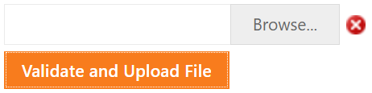

# Upload Control for ASP.NET Web Forms - How to implement custom validation rules
<!-- run online -->
**[[Run Online]](https://codecentral.devexpress.com/e3908/)**
<!-- run online end -->

This example demonstrates how to display an error icon if no file is selected.



## Overview

The main idea is to call the upload control's client-side [GetText](https://docs.devexpress.com/AspNet/js-ASPxClientUploadControl.GetText(index)) method to get the selected file's name. If no file is selected, the upload control displays an error icon.

```js
function OnClick(s, e) {
    var isValid = uploadControl.GetText() != "";
    img.SetVisible(!isValid);
    if (isValid)
        uploadControl.Upload();
}
```

```aspx
<dx:ASPxUploadControl ID="upload" runat="server" ClientInstanceName="uploadControl" ... />

<dx:ASPxImage ID="imgErrorIcon" runat="server" ClientInstanceName="img" ClientVisible="False" />

<dx:ASPxButton ID="btnCheck" runat="server" AutoPostBack="false" >
    <ClientSideEvents Click="OnClick" />
</dx:ASPxButton>
```

## Files to Review

* [Default.aspx](./CS/WebSite/Default.aspx) (VB: [Default.aspx](./VB/WebSite/Default.aspx))
* [Default.aspx.cs](./CS/WebSite/Default.aspx.cs) (VB: [Default.aspx.vb](./VB/WebSite/Default.aspx.vb))

## Documentation

* [Upload Control](https://docs.devexpress.com/AspNet/DevExpress.Web.ASPxUploadControl)
